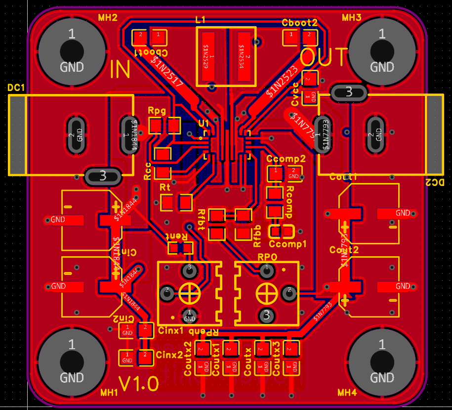
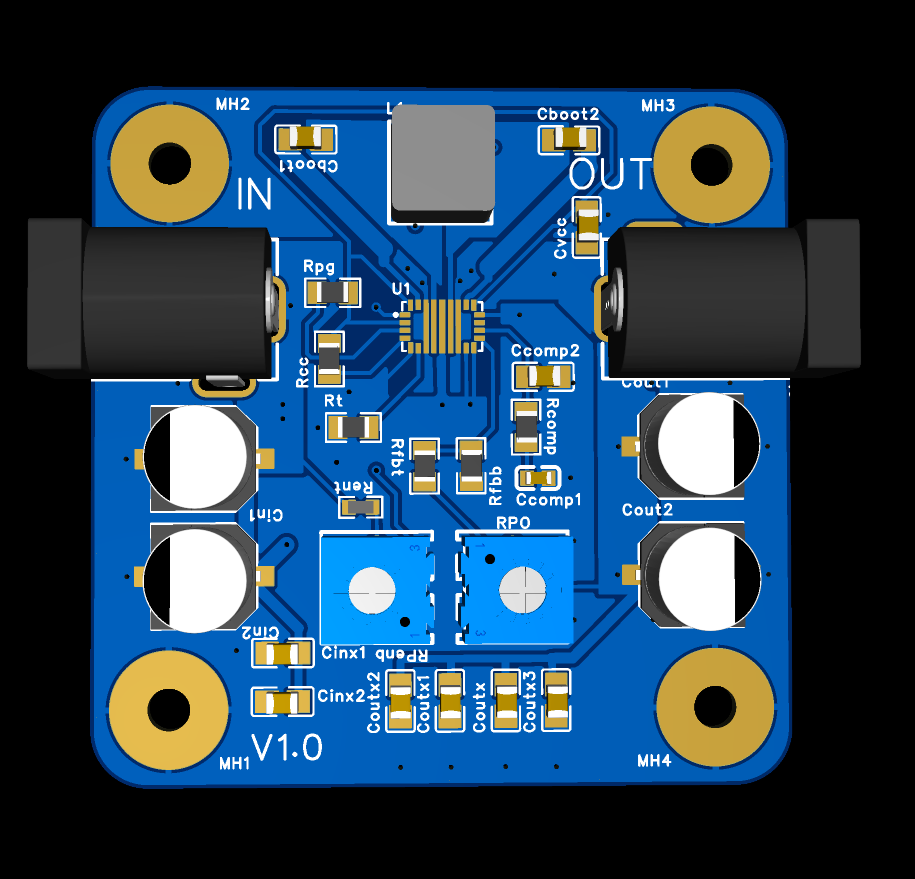
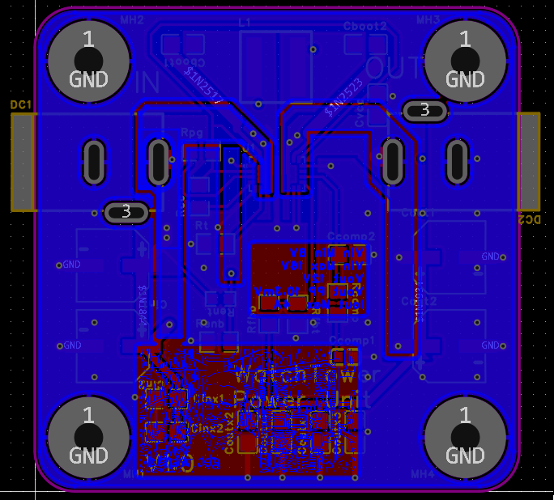

# synchronous-buck-boost-converter

  
  
  

# Overview

This project contains files and documentation for a submodule of Capstone project dubbed "Watchtower" for Team 16 (2025-26) at McMaster University. All design and documentation is original work unless otherwise noted, and may be used as reference for educational purposes. The author(s) provide no guarantees or warranties as to the functionality or safety of this design.

This high efficiency DC-DC converter is centered around the [TPS552892-Q1](https://www.ti.com/lit/ds/symlink/tps552892-q1.pdf) automotive grade synchronous programmable IC. It provides up to 5A output at >= 95% efficiency and is automotive qualified. This makes it suitable for applications where the input voltage can vary widely, such as battery-powered automotive systems.

# Specifications

| Parameter | Value |
|-----------|-------|
| Input Voltage Range | 4-16 V (adjustable) |
| Output Voltage Range | 5–20 V (adjustable) |
| Maximum Output Current | 4 A |
| Efficiency* | ≥95% |
| Current Sense Resistor | 0.01 Ω (disabled) |
| EN/UVLO Cutoff | 4+ V (adjustable) |

*Theoretical efficiency is dependent on input/output voltage and load conditions, and has yet to be validated in testing.

# Design

### EN/UVLO

This pin acts as programmable UVLO input with $1.23\ \text{V}$ internal reference.

Below $1.15\ \text{V}$ the device is in shutdown mode. Using a basic voltage divider circuit, we can use this to set the voltage cutoff for critical battery levels.

For example, for an $8\ \text{V}$ cutoff we must choose R1 with $\left(\frac{8}{1.15}-1\right)\approx6$ times greater value than R2.

The preliminary design was made with $R_{\text{ent}} = 560\,\text{k}\Omega,\ R_{\text{enb}} = 100\,\text{k}\Omega$ for a $7.6\ \text{V}$ cutoff.

$R_{\text{enb}}$ was replaced with a $200\,\text{k}\Omega$ rheostat for an adjustable cutoff of $\sim 4\ \text{V}+$.

### FB

Output voltage is configured with a voltage divider network. TI recommends $`R_{\text{FB\_UP}} = 100\,\text{k}\Omega`$. The reference voltage $V_{\text{REF}} = 1.2\,\text{V}$.

$`\frac{R_{\text{FB\_DOWN}}}{(100\,\text{k}\Omega + R_{\text{FB\_DOWN}})} \cdot V_{\text{out}} = 1.2,\quad R_{\text{FB\_DOWN}} = 11\,\text{k}\Omega \text{ at } 12\,\text{V}.`$

$R_{\text{fbt}}$ was replaced with a $51\,\text{k}\Omega$ resistor in series with a $200\,\text{k}\Omega$ rheostat, and $R_{\text{fb}}$ with a $16\,\text{k}\Omega$ resistor for an adjustable $V_{\text{out}}$ of $5{-}20\ \text{V}+$.

### PG & CC

- PG: Open-drain; high $\geq 95\%$, low <90%
- CC: Open-drain; outputs low when current-limiting

The primary design ties these to $100\,\text{k}\Omega$ resistors. These may be replaced with warning LEDs for debug.

### ISP & ISN

Current sense positive and negative across $R_{\text{sns}}$. $V_{\text{isp}} \geq 50\,\text{mV} + V_{\text{isn}}$. $`R_{\text{sns}} = \frac{V_{\text{sns}}}{I_{\text{OUT\_LIMIT}}}`$ where $R_{\text{sns}}$ is a resistor in line with $V_{\text{out}}$.

For a current limit of $5\ \text{A}$, $R_{\text{sns}} = 0.01\,\Omega$. This results in a power draw up to $0.25\,\text{W}$, determined to be not worth the efficiency loss, as this IC has built in over-temperature and short-circuit protection. As such, it is disabled by connection in the preliminary design.